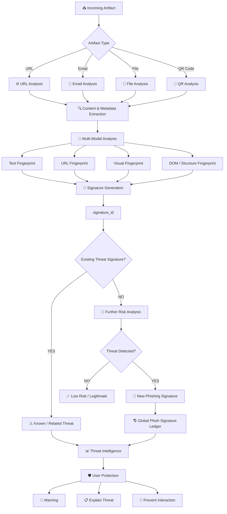
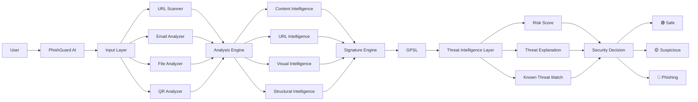

#  PhishGuard AI

### **AI-Powered Multi-Modal Phishing Detection & Global Threat Intelligence**

> **Don't just detect phishing. Remember it. Recognize it. Stop it everywhere.**

Phishing attacks are no longer limited to suspicious URLs or poorly written emails. Modern attacks can look **visually identical to legitimate websites**, use carefully crafted language, redirect through multiple domains, and repeatedly target thousands of users with slightly modified versions of the same attack.

**PhishGuard AI** is designed to address this problem by analyzing phishing attempts across **multiple dimensions — content, URLs, visual appearance, and webpage structure — and converting detected threats into a reusable digital fingerprint.**

Instead of treating every phishing attempt as a completely new attack, PhishGuard AI creates a **Global Phish Signature** that can be used to recognize similar threats in the future.

---

##  The Problem

Traditional phishing detection often focuses on a single signal:

```text
Suspicious URL
       ↓
      
   "Phishing"
```

But attackers can easily modify a URL, rewrite an email, change the page layout, or use a new domain.

That creates a fundamental problem:

> **What if the same attack changes its appearance slightly?**

PhishGuard AI approaches phishing detection as a **multi-modal identification problem**.

Instead of asking:

> "Does this URL look suspicious?"

It asks:

> **"Does this entire digital artifact resemble a previously identified phishing threat?"**

---

#  The Core Idea

PhishGuard AI analyzes a suspicious artifact through multiple signals:

```text
                 Suspicious Artifact
                         │
        ┌────────────────┼────────────────┐
        │                │                │
     Content            URL            Visual
        │                │                │
     Text Hash        URL Hash       Visual Hash
        │                │                │
        └────────────────┼────────────────┘
                         │
                     Structure
                         │
                    Struct Hash
                         │
                         ▼
              ┌─────────────────────┐
              │  Threat Signature   │
              │                     │
              │  text_hash          │
              │  url_hash           │
              │  visual_hash        │
              │  struct_hash        │
              └──────────┬──────────┘
                         │
                         ▼
                 signature_id
                         │
                         ▼
              Global Phish Signature
                     Ledger
```

The result is a **digital fingerprint of the attack**.

---

#  What Makes PhishGuard AI Different?

### Traditional Approach

```text
Input → Check URL → Verdict
```

### PhishGuard AI

```text
Input
  ↓
Content Analysis
  ↓
URL Analysis
  ↓
Visual Analysis
  ↓
Structural Analysis
  ↓
Multi-Modal Fingerprint
  ↓
Threat Signature
  ↓
Global Threat Ledger
  ↓
Match / Similarity Detection
  ↓
Risk Assessment
  ↓
Action
```

This allows the system to move from **isolated detection** toward **collective threat intelligence**.

---

#  Complete System Workflow



---

#  Multi-Modal Threat Fingerprinting

One of the central concepts behind PhishGuard AI is the creation of a **multi-dimensional phishing fingerprint**.

Each artifact can generate several fingerprints:

### 1.  Text Hash

Captures important characteristics of textual content.

```text
Email / Page Content
        ↓
Text Processing
        ↓
TF-IDF / Embedding Representation
        ↓
text_hash
```

This helps identify attacks that reuse similar language, messages, or social-engineering patterns.

---

### 2.  URL Hash

The URL is analyzed and converted into a normalized fingerprint.

```text
Suspicious URL
      ↓
Normalization
      ↓
URL Features
      ↓
url_hash
```

This provides a compact representation for identifying known or related malicious URLs.

---

### 3.  Visual Hash

Phishing websites often imitate legitimate services.

For example:

```text
Real Login Page
      │
      │ visually copied
      ▼
Fake Login Page
```

A perceptual visual fingerprint can help identify visually similar pages even when the underlying URL is different.

```text
Screenshot
    ↓
Visual Processing
    ↓
Perceptual Hash
    ↓
visual_hash
```

---

### 4.  Structural Hash

Two websites may look similar while using different URLs.

PhishGuard AI can also consider the underlying page structure:

```text
HTML / DOM
    ↓
Canonicalization
    ↓
Structural Representation
    ↓
struct_hash
```

This captures structural characteristics of the webpage rather than relying only on its appearance.

---

#  The Phish Signature

These signals are combined to create a stronger identity for the threat:

```text
                    ┌──────────────┐
                    │  text_hash   │
                    └──────┬───────┘
                           │
                    ┌──────▼───────┐
                    │   url_hash   │
                    └──────┬───────┘
                           │
                    ┌──────▼───────┐
                    │ visual_hash  │
                    └──────┬───────┘
                           │
                    ┌──────▼───────┐
                    │ struct_hash  │
                    └──────┬───────┘
                           │
                           ▼
                 ┌───────────────────┐
                 │  Signature Engine │
                 └─────────┬─────────┘
                           │
                           ▼
                    signature_id
```

Conceptually:

```text
signature_id =
Hash(
    text_hash +
    url_hash +
    visual_hash +
    struct_hash
)
```

The important idea is that **one weak signal does not have to determine the entire verdict**.

---

#  Global Phish Signature Ledger

PhishGuard AI introduces a shared threat-memory concept called the:

## **GPSL — Global Phish Signature Ledger**

When a new phishing threat is identified, its signature can be recorded in the ledger.

```text
New Threat
    ↓
Generate Signature
    ↓
Check GPSL
    ↓
┌───────────────────────┐
│ Signature Already Seen│
└───────────┬───────────┘
            │
       YES  │  NO
            │
     ┌──────▼──────┐
     │ Known Threat│
     └─────────────┘

                         NO
                          ↓
                  ┌───────────────┐
                  │ New Threat    │
                  │ Detected      │
                  └───────┬───────┘
                          ↓
                    Add Signature
                          ↓
                       GPSL
```

The goal is simple:

> **Every detected threat can become intelligence for the next detection.**

---

#  Detection Architecture



---

#  Key Features

##  Multi-Input Threat Detection

PhishGuard AI is designed around multiple attack surfaces:

* 🌐 URL
* 📧 Email
* 📄 Files
* 📱 QR Codes

---

## 🧠 Multi-Modal Intelligence

Instead of depending on a single feature:

* Text
* URL
* Visual appearance
* DOM / structure

are considered together.

---

##  Threat Fingerprinting

Every analyzed threat can be represented using a unique multi-signal signature.

---

##  Global Threat Memory

The **Global Phish Signature Ledger** provides a mechanism for storing previously detected phishing signatures.

---

##  Known Threat Recognition

If a new artifact matches an existing signature, the system can recognize it as a previously identified or related threat.

---

##  Explainable Threat Analysis

Instead of simply displaying:

>  PHISHING

the system can explain **why the artifact is suspicious** and which signals contributed to the decision.

---

##  Real-Time Security Experience

The frontend is designed around a security-dashboard experience where users can scan, analyze, and understand threats without needing cybersecurity expertise.

---

#  Product Experience

The interface is designed around a modern cybersecurity dashboard.

### Main Experience

```text
┌──────────────────────────────────────────────┐
│              PHISHGUARD AI                   │
│        AI-Powered Threat Protection           │
├──────────────────────────────────────────────┤
│                                              │
│  [ URL ] [ EMAIL ] [ FILE ] [ QR CODE ]     │
│                                              │
│  ┌────────────────────────────────────────┐  │
│  │ Paste suspicious content here...      │  │
│  │                                        │  │
│  │                                        │  │
│  └────────────────────────────────────────┘  │
│                                              │
│             [ 🔍 SCAN THREAT ]              │
│                                              │
├──────────────────────────────────────────────┤
│                THREAT RESULT                 │
│                                              │
│       🔴 HIGH RISK — PHISHING               │
│                                              │
│  URL Risk          █████████░  90%           │
│  Content Risk      ████████░░  82%           │
│  Visual Match      █████████░  91%           │
│  Structure Match   ███████░░░  74%           │
│                                              │
└──────────────────────────────────────────────┘
```

---

#  Technology Stack

### Frontend

*  React
*  Vite
*  CSS
*  React Icons
*  React Three Fiber / Three.js for immersive visual elements

### Backend

*  Node.js
*  Express.js

### Database

* 🍃 MongoDB

### Intelligence & Security

*  NLP / Text Analysis
*  URL Analysis
*  Perceptual Visual Hashing
*  DOM / Structural Fingerprinting
*  Cryptographic Hashing
*  Global Threat Signature Ledger

---

# 📁 Project Architecture

```text
PhishGuardAI/
│
├── 📁 frontend/
│   ├── components/
│   │   ├── Navbar
│   │   ├── Hero
│   │   ├── Scanner
│   │   ├── EmailAnalyzer
│   │   ├── ThreatDashboard
│   │   ├── AIInsights
│   │   ├── Features
│   │   └── Footer
│   │
│   ├── App.jsx
│   └── App.css
│
├── 📁 backend/
│   ├── routes/
│   ├── controllers/
│   ├── services/
│   ├── models/
│   └── server.js
│
├── 📁 utils/
│   ├── emailAnalyzer
│   ├── urlAnalyzer
│   ├── hashGenerator
│   └── threatDetection
│
└── README.md
```

> Adjust the folder names above to exactly match the current repository structure if your backend folders differ.

---

#  Getting Started

## 1️⃣ Clone the Repository

```bash
git clone <YOUR_REPOSITORY_URL>
cd PhishGuardAI
```

## 2️⃣ Install Dependencies

```bash
npm install
```

If frontend and backend are separated:

```bash
cd frontend
npm install

cd ../backend
npm install
```

## 3️⃣ Configure Environment Variables

Create a `.env` file:

```env
PORT=5000
MONGODB_URI=your_mongodb_connection_string
```

Add any AI/security API keys required by your implementation.

## 4️⃣ Start the Application

Frontend:

```bash
npm run dev
```

Backend:

```bash
npm start
```

---

#  Example Detection Flow

Imagine a user receives this email:

```text
Subject:
Your Bank Account Has Been Suspended!

Your account will be permanently locked.
Click here immediately to verify your identity.
```

The user submits it to PhishGuard AI.

### Step 1 — Content Analysis

The system identifies suspicious linguistic patterns.

```text
Urgency
Account Threat
Call-to-Action
Credential Request
        ↓
High Content Risk
```

### Step 2 — URL Analysis

The embedded URL is analyzed.

```text
Domain
Structure
Parameters
Suspicious Patterns
        ↓
URL Risk
```

### Step 3 — Visual Analysis

If the linked page imitates a legitimate service:

```text
Screenshot
    ↓
Perceptual Fingerprint
    ↓
visual_hash
```

### Step 4 — Structural Analysis

The webpage structure is analyzed:

```text
DOM
 ↓
Canonicalization
 ↓
struct_hash
```

### Step 5 — Signature Generation

```text
text_hash
     +
url_hash
     +
visual_hash
     +
struct_hash
     ↓
signature_id
```

### Step 6 — Threat Memory

The signature is checked against the Global Phish Signature Ledger.

```text
Known signature?
      │
 ┌────┴────┐
YES       NO
 │         │
 ▼         ▼
Known    Analyze
Threat   Further
```

### Step 7 — Final Decision

```text
Risk Score
    ↓
Threat Classification
    ↓
Explanation
    ↓
User Warning
```

---

#  Why This Architecture Matters

A phishing attack can change:

* its domain
* its wording
* its URL parameters
* its page design
* its HTML structure

But attackers often reuse **underlying patterns**.

PhishGuard AI attempts to capture these patterns from different dimensions.

This creates a more resilient security concept:

```text
                    ONE ATTACK
                        │
        ┌───────────────┼───────────────┐
        ▼               ▼               ▼
      URL            Content          Visual
        │               │               │
        └───────────────┼───────────────┘
                        ▼
                 Threat Signature
                        │
                        ▼
                Global Threat Memory
                        │
                        ▼
              Future Attack Detection
```

---

#  From Detection → Intelligence

The larger vision of PhishGuard AI is not simply:

```text
"Is this phishing?"
```

It is:

```text
"Have we seen this threat before?"

"Is this related to a known attack?"

"What characteristics make it suspicious?"

"Can this signature help detect future attacks?"
```

That shift transforms phishing detection from a **one-time decision** into a **continuous threat-intelligence system**.

---

#  Future Roadmap

### Phase 1 — Core Detection

* [x] URL scanning
* [x] Email analysis
* [x] Multi-modal fingerprint concept
* [x] Threat dashboard
* [x] Signature generation

### Phase 2 — Threat Intelligence

* [ ] Expand Global Phish Signature Ledger
* [ ] Similarity-based threat matching
* [ ] Threat history
* [ ] Attack clustering
* [ ] Confidence scoring

### Phase 3 — Browser Protection

* [ ] Chrome extension
* [ ] Firefox extension
* [ ] Real-time webpage scanning
* [ ] Automatic phishing warnings

### Phase 4 — Communication Security

* [ ] Gmail integration
* [ ] Outlook integration
* [ ] Automatic email scanning
* [ ] Suspicious attachment analysis

### Phase 5 — Global Intelligence

* [ ] Collaborative threat intelligence
* [ ] Real-time signature propagation
* [ ] Threat campaign identification
* [ ] Large-scale phishing attack correlation

---

#  Where PhishGuard AI Can Be Used

###  Individual Users

Protect users from:

* Fake login pages
* Credential theft
* Malicious links
* Scam emails
* QR-based phishing

###  Organizations

Potential applications include:

* Enterprise email security
* Employee security awareness
* SOC workflows
* Threat intelligence
* Incident investigation

###  Security Ecosystems

Potential integrations:

```text
PhishGuard AI
      │
      ├── Gmail
      ├── Outlook
      ├── Chrome
      ├── Firefox
      ├── Enterprise Security Systems
      └── Threat Intelligence Platforms
```

---

#  Project Vision

> **Build a security layer that doesn't forget.**

Every phishing attempt contains information.

Every detected attack can create intelligence.

Every stored signature can potentially help identify the next attack.

PhishGuard AI is built around this principle:

```text
              DETECT
                 ↓
              ANALYZE
                 ↓
            FINGERPRINT
                 ↓
              RECORD
                 ↓
             REMEMBER
                 ↓
             RECOGNIZE
                 ↓
              PROTECT
```

---

#  The Bigger Picture

The internet doesn't need another system that simply says:

> **"This looks suspicious."**

It needs systems that can understand **why** something is suspicious, recognize **relationships between attacks**, and use previously discovered intelligence to improve future protection.

That's the direction PhishGuard AI is designed to explore.

---

#  Built With

**PhishGuard AI** was developed as a cybersecurity-focused AI/software engineering project exploring:

* Artificial Intelligence
* Cybersecurity
* Threat Intelligence
* Web Development
* Digital Fingerprinting
* Hashing
* Pattern Recognition
* Blockchain-inspired threat storage
* Multi-modal security analysis

---

#  Project Status

🟢 **Active Prototype / Development**

PhishGuard AI is currently a prototype demonstrating the architecture and product concept. Some advanced detection, integrations, and large-scale threat-intelligence components are part of the future roadmap.

---

#  Support the Project

If you find the concept interesting:

⭐ Star the repository
🍴 Fork the project
🐛 Report issues
💡 Suggest improvements
🤝 Contribute to the project

---

## PhishGuard AI

### **Detect the threat. Fingerprint the attack. Remember the signature. Protect the next user.**

> **Security shouldn't just detect attacks.
> Security should learn from them.**
